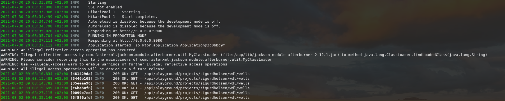

# Parsing of JSON logs

If you have a service that outputs logs in JSON format, you can pipe the output
through clog to make it more readable.

The output looks like this:


It will display the time in the local time zone, the request id if it exists, the severity, and the message.

## Installation

```sh
cargo install --git https://github.com/cognitedata/clog
```

## Usage with kubectl

```
kubectl logs POD_NAME CONTAINER_NAME --follow | clog
```
